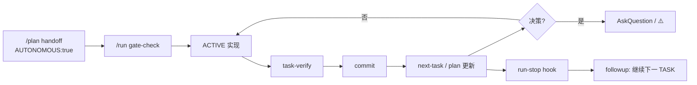

# 自治链 · 触点矩阵（SPIKE 参考）

Sprint 批准 `AUTONOMOUS:true` 后，用户 **只说一次 `/run`**；Agent 在同会话内连跑 TASK，**仅决策点**打断。本页供 plan/run/hooks 维护者对照。

## 数据流

## 配置 SSOT

| 键 | 文件 | 作用 |
|----|------|------|
| `autonomous.default` | `config/workflow.json` | 新 plan 模板默认是否自治 |
| `autonomous.max_loops_default` | 同上 | hooks `MAX_LOOPS` 参考 |
| `autonomous.confirm_before` | 同上 | 须用户确认的高风险动作 |
| `autonomous.interrupt_on` | 同上 | 停跑问人的决策类型 |
| `role.default` | 同上 | 默认人格 id（`roles.json`） |
| `<!-- AUTONOMOUS: ... -->` | `.cursorGrowth/plan.md` | 运行时覆盖（Sprint 级） |
| `<!-- MAX_LOOPS: ... -->` | plan | run-stop 循环上限 |

## CLI / hooks 触点

| 组件 | 路径 | 自治相关行为 |
|------|------|----------------|
| `gate-check` | `.cursor/bin/runner.sh` | `PLAN_APPROVED` + 非 `PLANNING` 才允许编码 |
| `next-task` | 同上 | 按 **执行顺序** 解析下一 `⬜`；**跳过** `prefixes_skip`（SPIKE/REV/DOC） |
| `run-start` | `.cursor/hooks/run-start.sh` | `sessionStart` 注入 Sprint/ACTIVE/人格 hint；`AUTONOMOUS` 时强调 **Sprint 连跑** |
| `run-stop` | `.cursor/hooks/run-stop.sh` | `status=completed` + `plan_autonomous` → `followup_message` 链下一 TASK |
| `plan-parse` | `.cursor/hooks/lib/plan-parse.sh` | `plan_autonomous()` 读 HTML 注释 |
| `json_followup` | `.cursor/hooks/lib/json-utils.sh` | 输出 `{"followup_message": "..."}` |

### run-stop 分支（摘要）

| 条件 | followup 意图 |
|------|----------------|
| `!plan_autonomous` | 无 followup |
| `loop_count >= MAX_LOOPS` | 停跑，人工续 |
| gate ≠ OK | 回 plan |
| ACTIVE `🔧`/`⬜` | 继续当前 TASK |
| plan 含 `\| ⚠️ \|` | 阻塞，回 plan |
| ACTIVE `✅` 且仍有 pending | 链下一 ID |
| pending = 0 | Sprint 收尾 verify/archive |

**注意**：hook 只发 **followup 文案**；Agent 须在 **同一会话** 内继续执行，勿等用户再次 `/run`（除非决策打断）。

## 决策打断矩阵

与 `workflow.json` → `autonomy.interrupt_on` 及 plan Sprint 表对齐：

| 类型 | 示例 | Agent |
|------|------|-------|
| `decision_needed` | 文档↔实现冲突 · 架构选型 · scope 扩大 | AskQuestion ≤4 · 可标 `⚠️` |
| `blocker` | verify 红且 2 轮自修失败 | 停跑 · `/plan` |
| `high_risk` | `confirm_before` 删除 · 库外写 | 必须用户确认 |
| `release` | merge · tag · push | **`/release`** 或用户明示 |
| `goal_drift` | 偏离 Sprint Goal / Out of scope | 停跑说明 |

**非决策（勿打断）**：TASK 切换 · commit · CHANGELOG · README 门面 · closeout Medium/Low · SDD 可推断路径

## 风格双轨

| 层 | SSOT | 作用 |
|----|------|------|
| **行为 SOP** | `rules/communication/super-cursor-persona.mdc` · `agent-discipline.mdc` | 少问多干 · verify · file:line |
| **语气品牌** | `config/roles.json` · `role.default` | 默认 `dashu`（老周）；会话可覆盖 `.cursorGrowth/session/persona.json` |

`run-start` 的 `sc_role_hint` 在自治块注入 **Persona hint**；语气不改变 skill 能力（`skills: full`）。

## 与 plan/run 分工

| 时机 | plan | run |
|------|------|-----|
| 设 `AUTONOMOUS:true` · 决策清单 | ✅ handoff | |
| 单 TASK 实现+verify+commit | | ✅ |
| Sprint 内连跑下一 ACTIVE | | ✅（同会话，非决策不停） |
| `⚠️` / Blocker | 重排 | 标状态停跑 |

## 已知限制

- Hook followup 依赖 Cursor `run-stop` 事件；Agent 仍应读 plan `ACTIVE` 自主续跑。
- `prefixes_skip`：SPIKE/REV/DOC 不进 `next-task` 自动队列，但可 **手动** 列为 ACTIVE（如本 Sprint SPIKE-001）。
- `AUTONOMOUS` 不关闭 `gate-check` / `task-verify` / commit 纪律。
