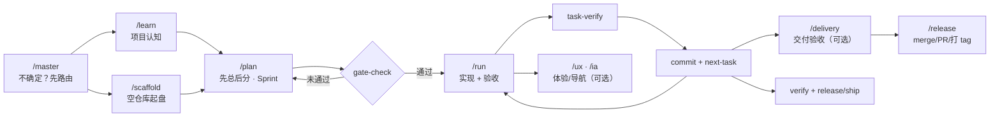

# Super Cursor

[](CHANGELOG.md)
[](https://github.com/wangqiqi/cursor-ai/stargazers)
[](https://github.com/wangqiqi/cursor-ai/issues)
[](.cursor/docs/platforms.md)
[](.cursor/docs/scaffold.md)
[](https://cursor.com)

让 Cursor Agent 像资深同事一样协作：先规划、再执行、可验收、能收尾、能发版。

> 不是又一个 `.cursorrules` 片段合集，而是一套**可安装、可复用、可演进**的 Agent 工作流母版。

---

## 一句话

把「怎么和 Agent 协作」从聊天里的口头约定，变成 **rules + skills + hooks + config** —— 装一次，每个仓库都能用；项目特化知识进 `.cursorGrowth/`（git 忽略），**不污染通用模板**。

> **Roo Code 兼容** — `.cursor/` 内的所有内容**也可以整体复制到 `.roo/`**（`cp -r .cursor .roo` 即可），既支持 **Roo Code** 模式，也兼容 **Cursor 内遵循相同 skills/rules 协议** 的 Agent；详见 [§ 兼容 Roo Code](#兼容-roo-code)。

## 适合谁

| 你可能是… | Super Cursor 帮你… |
|-----------|-------------------|
| 独立开发者 | 空仓库 5 分钟起盘，Agent 不再乱改一通 |
| 技术负责人 | 统一 plan/run 闸门，任务可追溯、验收可脚本化 |
| 新加入的成员 | `/master` 路由 + `/learn` 项目常识，少问重复问题 |
| 开源维护者 | security/api/git 审查 skills，发版有 release/ship 清单 |

## 开箱即用

```text
.cursor/
├── rules/      沟通 · 执行（含 oss-first · input-bounds · extensibility · data-batch · 长任务横切）· 反馈 · 13 种 tech 细则（含 Svelte）· 栈专用见 rules/local/
├── skills/     22 个：master · plan · run · learn · scaffold · git · release · security · api · ux · ia · debug · test（含 scripts/）· mcp（含 reference/evaluation）· refactor · perf · review · study · delivery（含 scripts/pdf）· week · disk · maintain
├── commands/   【日常】run · plan · master · 【生命周期】scaffold · learn · release · 【高级】delivery · ux · ia
├── agents/     ship · review · spike
├── hooks/      会话初始化 · run 循环控制
├── config/     workflow.json · release.json · roles.json
├── bin/        gate-check · task-verify · release-tag · scaffold · cursor-coherence
└── templates/  plan.md · 8 栈脚手架
```

**根目录（可直接 clone / 复制）：**

```text
.cursor/  install-super-cursor.sh  README.md  CHANGELOG.md  .gitignore  .cursorignore
# plan 工作副本：安装时从 templates/plan.md → workflow.json 的 plan_file（Growth，gitignore）
```

**一条命令安装到其它项目：**

```bash
git clone https://github.com/wangqiqi/cursor-ai.git
./install-super-cursor.sh /path/to/your-project
cd /path/to/your-project
bash .cursor/bin/platform-check.sh   # 可选：环境自检
```

| profile | 适合 |
|---------|------|
| `full`（默认） | 团队：plan/run + hooks |
| `lite` | 个人：plan/run，无 hooks |
| `rules-only` | 只要 rules/skills |

支持 **Linux · macOS · Windows（Git Bash）** — 无 `rsync` 自动 `cp -a`，无 `jq` 回退 `python3`。详见 [跨平台说明](.cursor/docs/platforms.md)。

## 工作流一览



**核心机制：**

- **任务地图** — ROADMAP/Goal（总）→ TASK/ACTIVE（分）→ 验收/archive；详见 [plan/run](.cursor/docs/plan-run.md)
- **闸门** — 无 `PLAN_APPROVED` 不写业务代码，避免 Agent「想到哪改到哪」
- **验收** — 每个 `TASK-*` 有可执行 Acceptance 列，`task-verify` 不过不 commit
- **沉淀** — 项目路径、模块地图、发版节奏 → `/learn` 写入 `.cursorGrowth/learn/`
- **边界** — 安装后 `.cursor/` 默认只读；团队差异用 `config/*.json` 或 `.cursor/rules/local/`（社区 rules → [rules-catalog](.cursor/docs/rules-catalog.md)）

## 和「只用 Cursor 默认 Agent」的差别

| 场景 | 默认 Agent | Super Cursor |
|------|-----------|--------------|
| 空仓库 | 「帮我建个 React 项目」→ 结构各异 | `/scaffold` → 8 栈标准层（lint/test/verify/CI） |
| 大需求 | 一次改很多文件，难 review | `/plan` 先总后分 → `/run` 逐条验收 |
| 新会话 | 重新解释项目结构 | `/learn` 读过 `.cursorGrowth/learn/` |
| 分支收尾 | merge/PR 靠口头约定 | **release** skill（§分支 4 选 1）· PR 维护用 `babysit` |
| 合并前 | 靠人想起来查安全/API | **security** · **api** · **delivery** · **git** skills |
| 发版 | 口头 checklist | **`/release`**（人）或 **ship**（自治执行同一清单） |

## 30 秒上手

对 Agent 说（**记三个即可**）：

```text
/run     # 默认：做事 · 写代码
/plan    # 拆 Sprint（无 ACTIVE 时）
/master  # 真迷路才用
```

完整 slash 见 [`.cursor/README.md`](.cursor/README.md) 三层表。常见路径：

```text
新仓库     →  /scaffold  →  /learn  →  /plan  →  /run
已有代码   →  /learn  →  /plan  →  /run
小修小补   →  /run 或描述复现步骤（bugfix rules）
```

| 层 | Command | 作用 |
|----|---------|------|
| **【日常】** | `/run` | 按 ACTIVE 实现 · `task-verify` · commit（**默认入口**） |
| **【日常】** | `/plan` | 先总后分：Goal · Done when → 拆 TASK |
| **【日常】** | `/master` | 真迷路时 AskQuestion 路由 |
| **【生命周期】** | `/scaffold` | 8 栈脚手架 / 已有项目 audit |
| **【生命周期】** | `/learn` | 项目认知 → `.cursorGrowth/learn/` |
| **【生命周期】** | `/release` | Sprint 出口：merge / PR / 打 tag |
| **【高级】** | `/delivery` | 交付验收：7 维（release 前建议） |
| **【高级】** | `/ux` · `/ia` | 体验分流 · 信息架构 |
| 工具（非主路径） | `/week` · `/disk` · `/maintain` | 周报 · 磁盘快照 · 环境维护 |

发版：**`/release`**（人主导清单）· **ship** agent（自治执行 **release §打版**，无独立 slash）。审查：**security** · **api** · **ux** · **ia** · **delivery** · **git**。

## 8 栈脚手架

每个栈自带 `scripts/test.sh`（开发循环）+ `scripts/verify.sh`（全量验收），与 plan/run 验收列对齐。

| 类别 | scaffold id | 技术栈 |
|------|-------------|--------|
| 前端 | `react-vite-ts` | React + Vite + TS + Vitest |
| 前端 | `vue-vite-ts` | Vue 3 + Vite + TS |
| 前端 | `nextjs-ts` | Next.js App Router + Vitest |
| 后端 | `go-api` | Go HTTP API |
| 后端 | `rust-axum` | Rust + Axum |
| 后端 | `python-fastapi` | FastAPI + ruff + mypy + pytest |
| 后端 | `java-gradle` | Java + Gradle Wrapper |
| 系统 | `cpp-cmake` | C++ + CMake + ctest |

```bash
./.cursor/bin/scaffold.sh list
./.cursor/bin/scaffold.sh apply go-api --dry-run   # 先预览
./.cursor/bin/scaffold.sh apply go-api
```

完整 walkthrough → [端到端示例](.cursor/docs/walkthrough.md)

## 效果型效率（少拉扯才是真省）

Agent 协作的「省钱」不是单次会话少说几句，而是 **总轮次少、方向对、一次可验证**。

```text
总成本 ≈ 固定开销 + 轮次 × token + 返工
```

压短回复或盲目压缩 rules，常带来更多纠偏与返工 —— **合计更贵，还可能降智**。Super Cursor 用 **闸门 + 验收 + 沉淀** 把成本花在「第一轮就对」上：

| 机制 | 作用 |
|------|------|
| `/plan` · `gate-check` | 先对齐 Goal，避免想到哪改到哪 |
| `task-verify` · Acceptance | 可验证才 commit，防假完成 |
| glob 按需 rules | 固定开销可控（仅 `core` + `workflow` 常驻） |
| `/learn` · `.cursorGrowth/` | 新会话少重复讲项目结构 |

日常习惯：**一事一对话** · 模糊先 `/plan` · 关键决策用强模型 · `@文件` 精准投喂。详述 → [效果型效率](.cursor/docs/effective-collaboration.md)

## 设计原则

1. **Universal only** — 母版不含公司路径，任何仓库都能装
2. **Config over fork** — 行为开关在 `config/*.json`，不必 fork 母版
3. **Growth boundary** — 项目认知只进 `.cursorGrowth/`，模板保持干净
4. **Immutable after install** — Agent 默认不改 `.cursor/`，除非你明确要求
5. **Protocol-agnostic** — `.cursor/` 用业界**开放的 skills/rules 协议**，整体复制到 `.roo/` 即可被 Roo Code 加载，详见下节
6. **Effectiveness over verbosity** — 结构防拉扯优先于压 token；见上节与 [effective-collaboration](.cursor/docs/effective-collaboration.md)

## 兼容 Roo Code

**Roo Code** 采用与 Cursor 兼容的 skills / rules / commands 协议，**Super Cursor 的所有内容可以原样投喂**。一次安装，两端生效：

```bash
# Cursor 用户：标准安装
./install-super-cursor.sh /path/to/your-project

# Roo Code 用户：复制到 .roo/ 即可
./install-super-cursor.sh /path/to/your-project
cp -r /path/to/your-project/.cursor /path/to/your-project/.roo
```

| 路径 | 作用 |
|------|------|
| `.cursor/` | Cursor Agent 加载（rules / skills / hooks / config） |
| `.roo/` | **可选**：Roo Code 加载同源内容（`cp -r .cursor .roo`） |
| `.cursorGrowth/` | 共享，**无需重复**（两边 Agent 都按 `learn/` 读序） |

**设计要点**：

- 母版**只**使用双方都识别的协议字段：`rules/*.mdc` · `skills/*/SKILL.md` · `agents/*.md` · `commands/*.md` · `config/*.json`
- **不**依赖 Cursor 私有特性（如 `.cursorrules` 单一文件、自定义 hooks 协议）
- `.cursorGrowth/` 内的 `plan.md` / `learn/` / `rules/local/` **只维护一份**，避免两边漂移
- 装一次、两端都用 —— 适合团队混用编辑器，或同时上 Cursor + Roo Code 的项目

> 协议细节见 [Roo Code 文档](https://docs.roocode.com) 与 Cursor 官方 `rules` / `skills` 加载机制。

## 文档

| 文档 | 说明 |
|------|------|
| [5 分钟上手](.cursor/docs/quickstart.md) | 最短闭环 |
| [效果型效率](.cursor/docs/effective-collaboration.md) | 少拉扯才是真省 · 与 skills 市场 token skill 的取舍 |
| [plan/run](.cursor/docs/plan-run.md) | 闸门、验收、hooks、先总后分 |
| [rules-catalog](.cursor/docs/rules-catalog.md) | 社区 rules 索引 · `rules/local/` 引用 |
| [使用场景（20+）](.cursor/README.md) | onboarding → 发版全场景 |
| [scaffold](.cursor/docs/scaffold.md) | 脚手架与 audit |
| [端到端示例](.cursor/docs/walkthrough.md) | go-api 可跟练 |
| [Building](.cursor/docs/building-super-cursor.md) | 扩展母版、贡献指南 |

## 验证

```bash
bash .cursor/bin/bootstrap-growth.sh           # 首次 clone：补 .cursorGrowth/rules/local（template-verify 会自动调用）
bash .cursor/verify-super-cursor.sh          # 布局检查
bash .cursor/bin/cursor-coherence.sh         # 交叉自洽（skills/agents/rules 注册）
bash .cursor/bin/template-verify.sh          # 母版完整自测（含 install/scaffold/runner/coherence）
```

## 参与

如果 Super Cursor 帮你省了重复教 Agent 的时间 —— 欢迎 [**Star**](https://github.com/wangqiqi/cursor-ai/stargazers) 支持，或用 [Issue](https://github.com/wangqiqi/cursor-ai/issues)/PR 反馈缺口。

- 扩展**通用**能力 → 改本仓库
- **项目私有**约定 → 目标仓库的 `.cursor/rules/local/`（见 [rules-catalog](.cursor/docs/rules-catalog.md) · 勿 commit 进母版 `.cursor/`）
